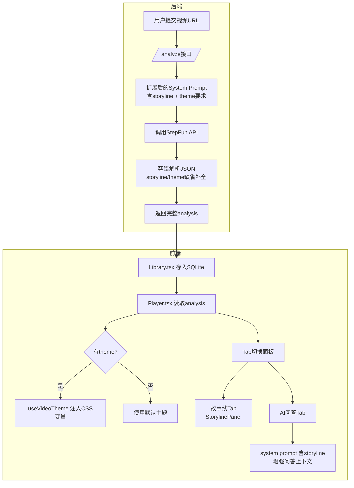

# ReelMind AI主题渲染与故事发展线 技术方案

## 1. 数据模型与API契约

### 1.1 扩展 analysis_json 结构

后端 `/analyze` 接口返回的 AI 内容中的 JSON 扩展为以下结构：

```typescript
interface VideoAnalysis {
  // 原有字段
  characters: Array<{ name: string; description: string }>;
  plotSummary: string;
  timeline: Array<{ time: string; event: string }>;
  relationships: Array<{ from: string; to: string; relation: string }>;

  // === 新增字段 ===
  storyline: StorylineEntry[];
  theme: ThemeVariables;
}

interface StorylineEntry {
  phase: string;        // 如 "第一幕：开篇"
  summary: string;      // 该阶段的剧情摘要
  highlights: string[]; // 关键情节点
  mood: string;         // 情绪标签，如 "紧张", "温馨"
}

interface ThemeVariables {
  primary: string;      // 主色调，如 "#C41E3A"
  secondary: string;    // 辅色调，如 "#1A1A2E"
  accent: string;       // 强调色，如 "#E94560"
  surface: string;      // 面板背景，如 "#16213E"
  text: string;         // 主文字色，如 "#EAEAEA"
  textMuted: string;    // 次要文字，如 "#A0A0A0"
  bubbleUser: string;   // 用户气泡背景
  bubbleAi: string;     // AI气泡背景
  tagBg: string;        // 标签背景
  tagText: string;      // 标签文字
  mood: string;         // 整体氛围词，如 "赛博朋克", "复古胶片"
}
```

### 1.2 后端新增 API

- `POST /analyze`：在原有基础上，system prompt 新增 storyline 和 theme 生成要求。
- 无需新增路由，复用现有 `/analyze`，返回结构向后兼容。

---

## 2. 后端方案

### 2.1 /analyze 接口 system prompt 扩展

在原有 prompt 中新增两个 section：

**storyline 要求：**
```
storyline 字段：将故事分为3-5个阶段，每个阶段包含 phase(阶段名), summary(100字摘要), highlights(关键情节点数组), mood(情绪标签)。
```

**theme 要求：**
```
theme 字段：根据视频内容分析出最适合的视觉主题。只输出以下CSS变量：
primary(主色调), secondary(辅色调), accent(强调色), surface(面板背景色), text(主文字色), textMuted(次要文字色), bubbleUser(用户聊天气泡背景), bubbleAi(AI聊天气泡背景), tagBg(标签背景), tagText(标签文字色), mood(主题氛围词)。
所有颜色必须是合法的hex格式。
```

### 2.2 AI输出容错解析

后端在解析 AI 返回的 JSON 时：
1. 先用正则提取 `{...}` 块
2. `JSON.parse` 尝试解析
3. 若 storyline/theme 字段缺失，用安全默认值补全（不抛错）
4. 若颜色值非法，回退到预设的主题默认值

---

## 3. 前端方案

### 3.1 类型定义

创建 `src/types/analysis.ts`：
- 导出完整的 `VideoAnalysis`, `StorylineEntry`, `ThemeVariables` 接口
- 提供 `defaultTheme(): ThemeVariables` 安全回退函数

### 3.2 主题系统（useVideoTheme Hook）

创建 `src/hooks/useVideoTheme.ts`：
- 接收 `analysis: VideoAnalysis | null`
- 当 `analysis.theme` 存在时，通过 `document.documentElement.style.setProperty('--xxx', value)` 注入 CSS 变量
- 当 `analysis` 为 null 或缺少 theme 时，注入默认变量
- 组件卸载时重置为默认主题

创建 `src/styles/theme.css`：
- 预定义所有 theme 相关类使用 CSS 变量，如 `.theme-panel`, `.theme-bubble-user` 等
- 在 `Player` 面板的 DOM 节点上加 `className="theme-panel"`，让其消费变量

### 3.3 故事线组件

创建 `src/components/StorylinePanel.tsx`：
- 接收 `storyline: StorylineEntry[]`
- 纯文本结构化渲染：
  - 每个 phase 为一个卡片块
  - 显示 phase 标题（大字体）
  - 显示 summary 段落
  - highlights 用带颜色的小标签/列表项展示
  - mood 作为右侧小徽章展示
- 使用 CSS 变量控制颜色（继承自 useVideoTheme）

### 3.4 Player 页面重构

当前 `Player.tsx` 右侧只有一个 AI 问答面板。重构为**底部/右侧 Tab 切换面板**：

```
┌──────────────────────────────────────────────────┐
│  视频播放区（不变，黑色背景）                        │
│                                                  │
│                                                  │
│                        [AI 🤖 按钮]               │
├──────────────────────────────────────────────────┤
│  Tab: [故事线] [AI问答]                            │
│  ─────────────────────────────────────────────   │
│  面板内容区（根据Tab切换，使用theme变量着色）        │
└──────────────────────────────────────────────────┘
```

面板 UI 调整：
- 点击 🤖 按钮后，面板从右侧滑出（保留现有动画）
- 面板顶部增加 Tab 切换："故事线" / "AI问答"
- 默认选中 "AI问答"（保留现有行为）
- "故事线" Tab 展示 `StorylinePanel`

### 3.5 AI问答上下文增强

在 `sendMessage` 构建 system prompt 时，将 `storyline` 内容也纳入上下文：

```
基于以下视频分析回答用户问题：
剧情摘要：${plotSummary}
角色：${characters}
故事发展线：
${storyline.map(s => `- ${s.phase}: ${s.summary}`).join('\n')}
```

这样 AI 问答可以基于更完整的剧情发展脉络回答。

### 3.6 兼容降级

- 老视频（没有 storyline/theme）：
  - `StorylinePanel` 显示 "暂无故事线数据" 占位提示
  - 主题使用 `defaultTheme()` 默认蓝灰色调
  - AI 问答上下文只使用原有 plotSummary + characters
- `theme` 字段部分缺失：用默认值补全缺失的颜色变量

---

## 4. AI Prompt 规范

### 4.1 system prompt 完整模板

```
你是一个专业的视频分析助手。请分析视频内容并输出严格JSON格式，不要输出任何其他文字：

{
  "characters": [{"name": "角色名", "description": "角色描述"}],
  "plotSummary": "剧情摘要，200字以内",
  "timeline": [{"time": "00:05:30", "event": "事件描述"}],
  "relationships": [{"from": "角色A", "to": "角色B", "relation": "关系类型"}],
  "storyline": [
    {
      "phase": "阶段名称如：第一幕：开篇",
      "summary": "该阶段100字以内剧情摘要",
      "highlights": ["关键情节点1", "关键情节点2"],
      "mood": "情绪标签如：紧张、温馨、悬疑"
    }
  ],
  "theme": {
    "primary": "#RRGGBB",
    "secondary": "#RRGGBB",
    "accent": "#RRGGBB",
    "surface": "#RRGGBB",
    "text": "#RRGGBB",
    "textMuted": "#RRGGBB",
    "bubbleUser": "#RRGGBB",
    "bubbleAi": "#RRGGBB",
    "tagBg": "#RRGGBB",
    "tagText": "#RRGGBB",
    "mood": "主题氛围词如：赛博朋克、复古胶片、清新治愈"
  }
}

要求：
1. storyline 分3-5个阶段，必须覆盖故事的起承转合
2. theme 的颜色必须基于视频内容的视觉风格，如科幻片用冷色调，爱情片用暖色调
3. 所有颜色必须是合法的 6位 hex 格式
4. 只输出 JSON，不要markdown代码块，不要解释文字
```

### 4.2 前端问答 system prompt

```
你是一位资深影视解读助手。用户正在观看一个视频，以下是该视频的分析信息：

【剧情摘要】${plotSummary}

【角色信息】
${characters.map(c => `- ${c.name}: ${c.description}`).join('\n')}

【故事发展线】
${storyline.map(s => `### ${s.phase}\n${s.summary}\n关键节点：${s.highlights.join('、')}\n情绪：${s.mood}`).join('\n\n')}

请基于以上信息回答用户的问题。回答要准确、简洁，可以适当引用剧情中的细节。
```

---

## 5. 文件变更清单

| 文件 | 动作 | 说明 |
|------|------|------|
| `reelmind-proxy/index.js` | 修改 | 扩展 prompt，增强 JSON 容错解析 |
| `reelmind-app/src/types/analysis.ts` | 新增 | 类型定义 |
| `reelmind-app/src/hooks/useVideoTheme.ts` | 新增 | 主题 CSS 变量注入 hook |
| `reelmind-app/src/components/StorylinePanel.tsx` | 新增 | 故事线展示组件 |
| `reelmind-app/src/pages/Player.tsx` | 修改 | 整合 Tab 切换、主题系统、故事线 |
| `reelmind-app/src/styles/theme.css` | 新增 | CSS 变量预设样式 |

---

## 6. 数据流图


